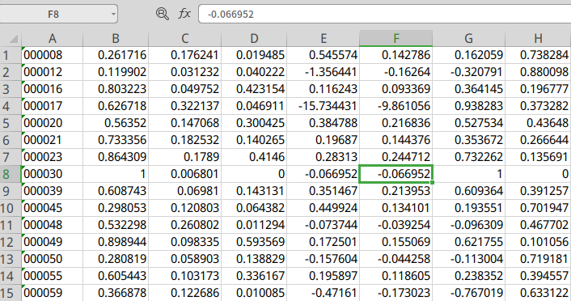
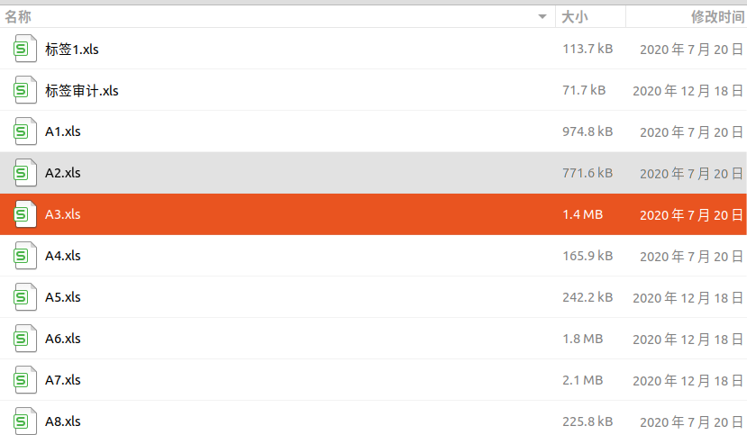
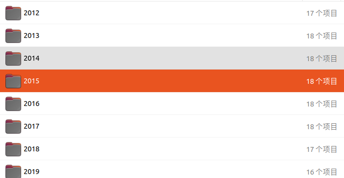

## 介绍：实验室的老师写论文需要进行比照实验，于是创建这个库。

实验内容：

- 数据：老师给了我一些数据：2012-2019年接近两千个上市公司的一些特诊数据，具体是哪些特征还不清楚。
  每个文件夹有A1-A15个表格。后面会介绍数据。

- 使用的方法：首先需要对数据进行处理，将每年数据的特征合并，去掉某些特定特征的公司，然后将数据进行归一化，将归一化的数据进行采样，使用各种方法进行分类。
- 采样方法：
  - 过采样：Random Oversampling，SMOTE，Border-line SMOTE，ADASYN
  - 欠采样：Random Undersampling，EasyEnsemble，BalanceCascade，NearMiss
  - 过采样和欠采样结合：SMOTE+ENN
- 分类方法：MLP，朴素贝叶斯，C4.5，随机森林，bagging。

数据：

例子：A1.xls：

A列表示公司的代号，后面的列是公司的某些特征数据。

每年的数据有A1-A15个表格。**每年的公司数量是一定的**，所以需要把特征按0轴合并到一起进行训练。

有2012年到2019年的数据

